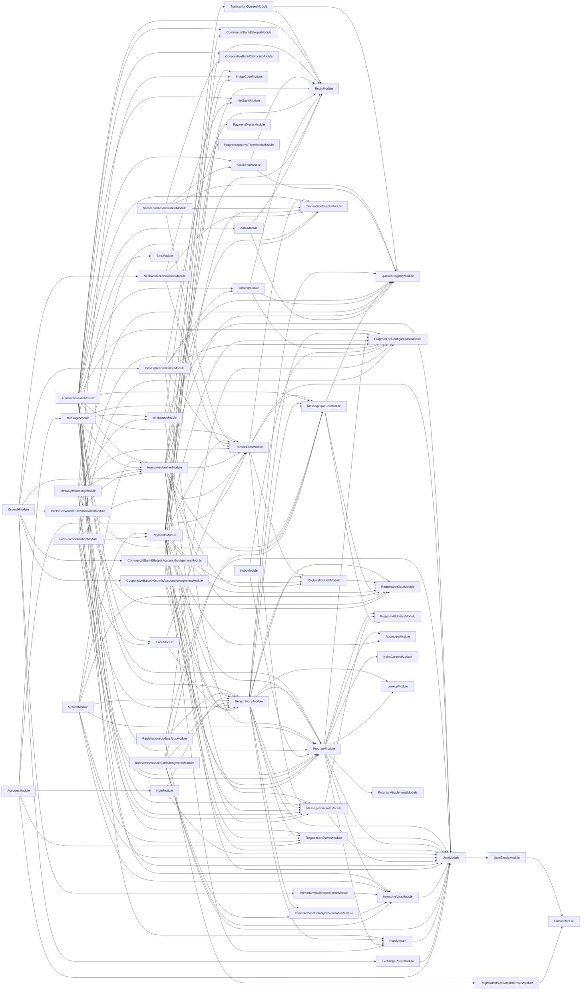

# Module Dependencies Graph

```mermaid
graph LR
  ActivitiesModule-->MessageModule
  ActivitiesModule-->NoteModule
  ActivitiesModule-->RegistrationEventsModule
  ActivitiesModule-->TransactionsModule
  ActivitiesModule-->UserModule
  AirtelModule-->QueuesRegistryModule
  AirtelModule-->RedisModule
  CommercialBankEthiopiaAccountManagementModule-->CommercialBankEthiopiaModule
  CommercialBankEthiopiaAccountManagementModule-->ProgramModule
  CommercialBankEthiopiaAccountManagementModule-->RegistrationsModule
  CooperativeBankOfOromiaAccountManagementModule-->CooperativeBankOfOromiaModule
  CooperativeBankOfOromiaAccountManagementModule-->ProgramModule
  CooperativeBankOfOromiaAccountManagementModule-->RegistrationsModule
  CronjobModule-->CommercialBankEthiopiaAccountManagementModule
  CronjobModule-->CooperativeBankOfOromiaAccountManagementModule
  CronjobModule-->ExchangeRatesModule
  CronjobModule-->IntersolveVisaReconciliationModule
  CronjobModule-->IntersolveVoucherModule
  CronjobModule-->IntersolveVoucherReconciliationModule
  CronjobModule-->NedbankReconciliationModule
  CronjobModule-->OnafriqReconciliationModule
  ExcelModule-->RegistrationsModule
  ExcelModule-->TransactionsModule
  ExcelReconcilicationModule-->ExcelModule
  ExcelReconcilicationModule-->PaymentsModule
  ExcelReconcilicationModule-->ProgramFspConfigurationsModule
  ExcelReconcilicationModule-->ProgramModule
  ExcelReconcilicationModule-->RegistrationsModule
  ExcelReconcilicationModule-->TransactionEventsModule
  ExcelReconcilicationModule-->TransactionsModule
  ExchangeRatesModule-->UserModule
  FspsModule-->UserModule
  IntersolveVisaAccountManagementModule-->IntersolveVisaDataSynchronizationModule
  IntersolveVisaAccountManagementModule-->IntersolveVisaModule
  IntersolveVisaAccountManagementModule-->MessageQueuesModule
  IntersolveVisaAccountManagementModule-->ProgramFspConfigurationsModule
  IntersolveVisaAccountManagementModule-->RegistrationsModule
  IntersolveVisaAccountManagementModule-->UserModule
  IntersolveVisaDataSynchronizationModule-->IntersolveVisaModule
  IntersolveVisaModule-->UserModule
  IntersolveVisaReconciliationModule-->IntersolveVisaModule
  IntersolveVoucherModule-->ImageCodeModule
  IntersolveVoucherModule-->MessageQueuesModule
  IntersolveVoucherModule-->MessageTemplateModule
  IntersolveVoucherModule-->QueuesRegistryModule
  IntersolveVoucherModule-->RedisModule
  IntersolveVoucherModule-->RegistrationDataModule
  IntersolveVoucherModule-->RegistrationUtilsModule
  IntersolveVoucherModule-->TransactionEventsModule
  IntersolveVoucherModule-->TransactionsModule
  IntersolveVoucherModule-->UserModule
  IntersolveVoucherReconciliationModule-->IntersolveVoucherModule
  IntersolveVoucherReconciliationModule-->ProgramFspConfigurationsModule
  IntersolveVoucherReconciliationModule-->ProgramModule
  KoboModule-->ProgramFspConfigurationsModule
  KoboModule-->ProgramModule
  MessageIncomingModule-->ImageCodeModule
  MessageIncomingModule-->IntersolveVoucherModule
  MessageIncomingModule-->MessageQueuesModule
  MessageIncomingModule-->MessageTemplateModule
  MessageIncomingModule-->QueuesRegistryModule
  MessageIncomingModule-->RegistrationDataModule
  MessageIncomingModule-->TransactionsModule
  MessageIncomingModule-->UserModule
  MessageIncomingModule-->WhatsappModule
  MessageModule-->IntersolveVoucherModule
  MessageModule-->MessageQueuesModule
  MessageModule-->MessageTemplateModule
  MessageModule-->ProgramModule
  MessageModule-->SmsModule
  MessageModule-->WhatsappModule
  MessageQueuesModule-->ProgramAttributesModule
  MessageQueuesModule-->QueuesRegistryModule
  MessageQueuesModule-->RegistrationDataModule
  MessageTemplateModule-->ProgramAttributesModule
  MessageTemplateModule-->UserModule
  MetricsModule-->IntersolveVisaModule
  MetricsModule-->IntersolveVoucherModule
  MetricsModule-->PaymentsModule
  MetricsModule-->ProgramModule
  MetricsModule-->RegistrationDataModule
  MetricsModule-->RegistrationEventsModule
  MetricsModule-->RegistrationsModule
  MetricsModule-->UserModule
  NedbankReconciliationModule-->NedbankModule
  NedbankReconciliationModule-->TransactionEventsModule
  NedbankReconciliationModule-->TransactionsModule
  NoteModule-->RegistrationsModule
  NoteModule-->UserModule
  OnafriqModule-->ProgramFspConfigurationsModule
  OnafriqModule-->QueuesRegistryModule
  OnafriqModule-->RedisModule
  OnafriqReconciliationModule-->OnafriqModule
  OnafriqReconciliationModule-->ProgramFspConfigurationsModule
  OnafriqReconciliationModule-->ProgramModule
  OnafriqReconciliationModule-->QueuesRegistryModule
  OnafriqReconciliationModule-->RedisModule
  OnafriqReconciliationModule-->TransactionsModule
  PaymentsModule-->ApproversModule
  PaymentsModule-->FspsModule
  PaymentsModule-->MessageTemplateModule
  PaymentsModule-->PaymentEventsModule
  PaymentsModule-->ProgramApprovalThresholdsModule
  PaymentsModule-->ProgramFspConfigurationsModule
  PaymentsModule-->ProgramModule
  PaymentsModule-->RedisModule
  PaymentsModule-->RegistrationDataModule
  PaymentsModule-->RegistrationEventsModule
  PaymentsModule-->RegistrationUtilsModule
  PaymentsModule-->RegistrationsModule
  PaymentsModule-->TransactionEventsModule
  PaymentsModule-->TransactionQueuesModule
  PaymentsModule-->TransactionsModule
  PaymentsModule-->UserModule
  ProgramModule-->ApproversModule
  ProgramModule-->FspsModule
  ProgramModule-->IntersolveVisaModule
  ProgramModule-->KoboConnectModule
  ProgramModule-->LookupModule
  ProgramModule-->ProgramAttachmentsModule
  ProgramModule-->ProgramAttributesModule
  ProgramModule-->ProgramFspConfigurationsModule
  ProgramModule-->UserModule
  RegistrationEventsModule-->UserModule
  RegistrationUtilsModule-->RegistrationDataModule
  RegistrationsModule-->FspsModule
  RegistrationsModule-->IntersolveVisaDataSynchronizationModule
  RegistrationsModule-->LookupModule
  RegistrationsModule-->MessageQueuesModule
  RegistrationsModule-->MessageTemplateModule
  RegistrationsModule-->ProgramFspConfigurationsModule
  RegistrationsModule-->ProgramModule
  RegistrationsModule-->QueuesRegistryModule
  RegistrationsModule-->RegistrationDataModule
  RegistrationsModule-->RegistrationEventsModule
  RegistrationsModule-->RegistrationUtilsModule
  RegistrationsModule-->UserModule
  RegistrationsUpdateJobEmailsModule-->EmailsModule
  RegistrationsUpdateJobsModule-->RegistrationsModule
  RegistrationsUpdateJobsModule-->RegistrationsUpdateJobEmailsModule
  RegistrationsUpdateJobsModule-->UserModule
  SafaricomModule-->QueuesRegistryModule
  SafaricomModule-->RedisModule
  SafaricomReconciliationModule-->QueuesRegistryModule
  SafaricomReconciliationModule-->RedisModule
  SafaricomReconciliationModule-->SafaricomModule
  SafaricomReconciliationModule-->TransactionEventsModule
  SafaricomReconciliationModule-->TransactionsModule
  TransactionJobsModule-->AirtelModule
  TransactionJobsModule-->CommercialBankEthiopiaModule
  TransactionJobsModule-->CooperativeBankOfOromiaModule
  TransactionJobsModule-->ExcelModule
  TransactionJobsModule-->FspsModule
  TransactionJobsModule-->IntersolveVisaModule
  TransactionJobsModule-->IntersolveVoucherModule
  TransactionJobsModule-->MessageQueuesModule
  TransactionJobsModule-->MessageTemplateModule
  TransactionJobsModule-->NedbankModule
  TransactionJobsModule-->OnafriqModule
  TransactionJobsModule-->ProgramFspConfigurationsModule
  TransactionJobsModule-->ProgramModule
  TransactionJobsModule-->RedisModule
  TransactionJobsModule-->RegistrationEventsModule
  TransactionJobsModule-->RegistrationsModule
  TransactionJobsModule-->SafaricomModule
  TransactionJobsModule-->TransactionEventsModule
  TransactionJobsModule-->TransactionsModule
  TransactionQueuesModule-->QueuesRegistryModule
  TransactionQueuesModule-->RedisModule
  TransactionsModule-->MessageQueuesModule
  TransactionsModule-->MessageTemplateModule
  TransactionsModule-->RegistrationUtilsModule
  TransactionsModule-->TransactionEventsModule
  TransactionsModule-->UserModule
  UserEmailsModule-->EmailsModule
  UserModule-->UserEmailsModule
  WhatsappModule-->ImageCodeModule
  WhatsappModule-->MessageTemplateModule
  WhatsappModule-->UserModule
```
