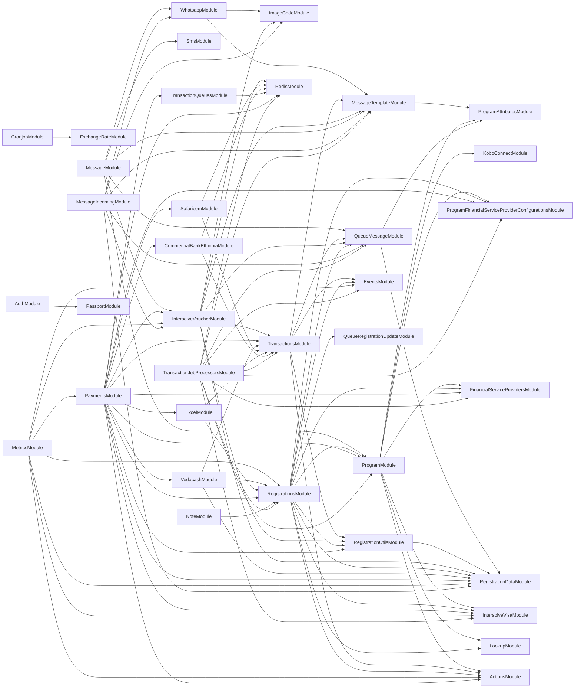

# Module Dependencies Graph

```mermaid
graph LR
  CronjobModule-->ExchangeRateModule
  MessageTemplateModule-->ProgramAttributesModule
  ProgramModule-->ActionsModule
  ProgramModule-->FinancialServiceProvidersModule
  ProgramModule-->LookupModule
  ProgramModule-->ProgramAttributesModule
  ProgramModule-->KoboConnectModule
  ProgramModule-->ProgramFinancialServiceProviderConfigurationsModule
  ProgramModule-->IntersolveVisaModule
  MessageModule-->WhatsappModule
  WhatsappModule-->ImageCodeModule
  WhatsappModule-->MessageTemplateModule
  MessageModule-->SmsModule
  MessageModule-->QueueMessageModule
  QueueMessageModule-->ProgramAttributesModule
  QueueMessageModule-->RegistrationDataModule
  MessageModule-->IntersolveVoucherModule
  IntersolveVoucherModule-->ImageCodeModule
  IntersolveVoucherModule-->TransactionsModule
  TransactionsModule-->ActionsModule
  TransactionsModule-->QueueMessageModule
  TransactionsModule-->MessageTemplateModule
  TransactionsModule-->RegistrationUtilsModule
  RegistrationUtilsModule-->RegistrationDataModule
  TransactionsModule-->EventsModule
  IntersolveVoucherModule-->QueueMessageModule
  IntersolveVoucherModule-->MessageTemplateModule
  IntersolveVoucherModule-->RegistrationDataModule
  IntersolveVoucherModule-->RegistrationUtilsModule
  IntersolveVoucherModule-->RedisModule
  MessageModule-->MessageTemplateModule
  MessageModule-->ProgramModule
  MetricsModule-->RegistrationsModule
  RegistrationsModule-->LookupModule
  RegistrationsModule-->ActionsModule
  RegistrationsModule-->ProgramModule
  RegistrationsModule-->FinancialServiceProvidersModule
  RegistrationsModule-->QueueMessageModule
  RegistrationsModule-->IntersolveVisaModule
  RegistrationsModule-->RegistrationDataModule
  RegistrationsModule-->RegistrationUtilsModule
  RegistrationsModule-->EventsModule
  RegistrationsModule-->QueueRegistrationUpdateModule
  RegistrationsModule-->ProgramFinancialServiceProviderConfigurationsModule
  MetricsModule-->ActionsModule
  MetricsModule-->PaymentsModule
  PaymentsModule-->ActionsModule
  PaymentsModule-->IntersolveVoucherModule
  PaymentsModule-->IntersolveVisaModule
  PaymentsModule-->TransactionsModule
  PaymentsModule-->VodacashModule
  VodacashModule-->TransactionsModule
  VodacashModule-->RegistrationDataModule
  VodacashModule-->RegistrationsModule
  PaymentsModule-->SafaricomModule
  SafaricomModule-->TransactionsModule
  SafaricomModule-->RedisModule
  PaymentsModule-->ExcelModule
  ExcelModule-->TransactionsModule
  ExcelModule-->RegistrationsModule
  PaymentsModule-->CommercialBankEthiopiaModule
  CommercialBankEthiopiaModule-->TransactionsModule
  CommercialBankEthiopiaModule-->RedisModule
  PaymentsModule-->RegistrationsModule
  PaymentsModule-->ProgramModule
  PaymentsModule-->RegistrationUtilsModule
  PaymentsModule-->RegistrationDataModule
  PaymentsModule-->TransactionQueuesModule
  TransactionQueuesModule-->RedisModule
  PaymentsModule-->FinancialServiceProvidersModule
  PaymentsModule-->ProgramFinancialServiceProviderConfigurationsModule
  PaymentsModule-->RedisModule
  MetricsModule-->IntersolveVisaModule
  MetricsModule-->IntersolveVoucherModule
  MetricsModule-->EventsModule
  MetricsModule-->RegistrationDataModule
  MessageIncomingModule-->ImageCodeModule
  MessageIncomingModule-->IntersolveVoucherModule
  MessageIncomingModule-->WhatsappModule
  MessageIncomingModule-->QueueMessageModule
  MessageIncomingModule-->MessageTemplateModule
  MessageIncomingModule-->RegistrationDataModule
  NoteModule-->RegistrationsModule
  AuthModule-->PassportModule
  TransactionJobProcessorsModule-->RedisModule
  TransactionJobProcessorsModule-->IntersolveVisaModule
  TransactionJobProcessorsModule-->ProgramFinancialServiceProviderConfigurationsModule
  TransactionJobProcessorsModule-->RegistrationsModule
  TransactionJobProcessorsModule-->ProgramModule
  TransactionJobProcessorsModule-->TransactionsModule
  TransactionJobProcessorsModule-->QueueMessageModule
  TransactionJobProcessorsModule-->FinancialServiceProvidersModule
  TransactionJobProcessorsModule-->EventsModule
  TransactionJobProcessorsModule-->MessageTemplateModule
```
