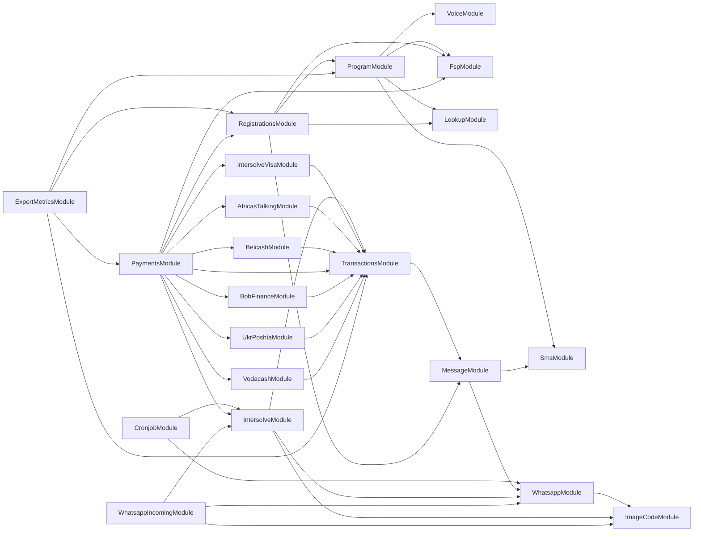

# Module Dependencies Graph

```mermaid
graph LR
  ProgramModule-->SmsModule
  ProgramModule-->VoiceModule
  ProgramModule-->FspModule
  ProgramModule-->LookupModule
  CronjobModule-->WhatsappModule
  WhatsappModule-->ImageCodeModule
  CronjobModule-->IntersolveModule
  IntersolveModule-->ImageCodeModule
  IntersolveModule-->TransactionsModule
  TransactionsModule-->MessageModule
  MessageModule-->WhatsappModule
  MessageModule-->SmsModule
  IntersolveModule-->WhatsappModule
  RegistrationsModule-->LookupModule
  RegistrationsModule-->ProgramModule
  RegistrationsModule-->FspModule
  RegistrationsModule-->MessageModule
  ExportMetricsModule-->ProgramModule
  ExportMetricsModule-->RegistrationsModule
  ExportMetricsModule-->PaymentsModule
  PaymentsModule-->FspModule
  PaymentsModule-->IntersolveModule
  PaymentsModule-->IntersolveVisaModule
  IntersolveVisaModule-->TransactionsModule
  PaymentsModule-->AfricasTalkingModule
  AfricasTalkingModule-->TransactionsModule
  PaymentsModule-->BelcashModule
  BelcashModule-->TransactionsModule
  PaymentsModule-->TransactionsModule
  PaymentsModule-->BobFinanceModule
  BobFinanceModule-->TransactionsModule
  PaymentsModule-->UkrPoshtaModule
  UkrPoshtaModule-->TransactionsModule
  PaymentsModule-->VodacashModule
  VodacashModule-->TransactionsModule
  PaymentsModule-->RegistrationsModule
  ExportMetricsModule-->TransactionsModule
  WhatsappIncomingModule-->ImageCodeModule
  WhatsappIncomingModule-->IntersolveModule
  WhatsappIncomingModule-->WhatsappModule
```
